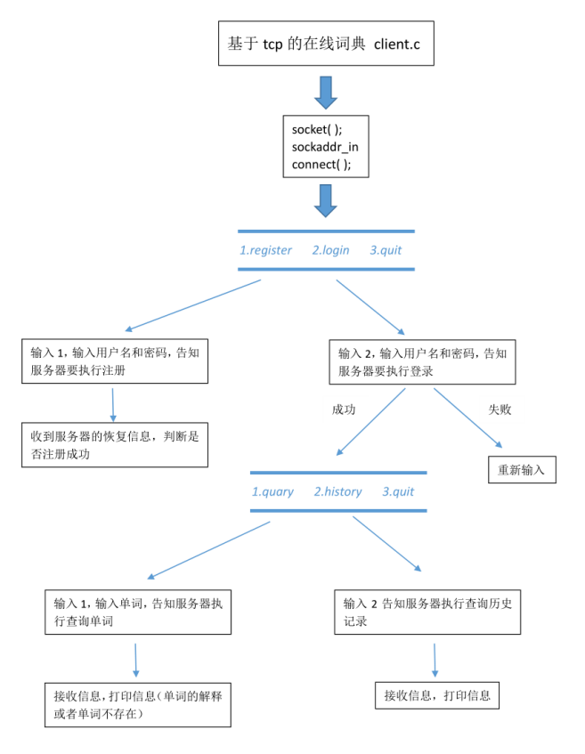
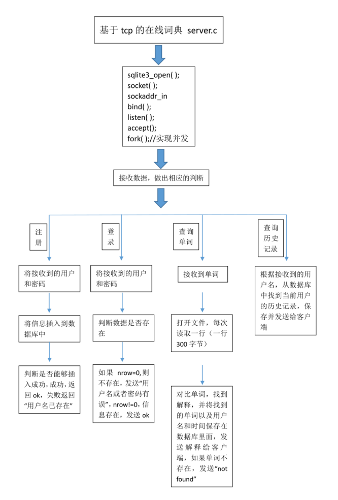

# 基于TCP的在线词典
## 功能说明
大方向一共四个功能:
1. 注册
2. 登录
3. 查询单词
4. 查询历史记录  

单词和解释保存在文件中，单词和解释只占一行,一行最多300个字节，单词和解释之间至少有一个空格

也可以先写个程序，将文件中的内容先都插入到数据库中。  
```c
fgets---> sqlite3_exec("INSERT INTO dict VALUES('word','解释')");
```  

实现TCP并发 --多进程 多线程 io多路复用 均可  
建表语句：--在sqlite3终端执行即可
```sql
CREATE TABLE usr (name TEXT PRIMARY KEY, pass TEXT);
CREATE TABLE record (name TEXT, date TEXT, word TEXT);
```
## 流程图



## 功能实现
1. 搭建程序框架
2. 实现注册和登录功能
3. 查单词
4. 查历史记录
